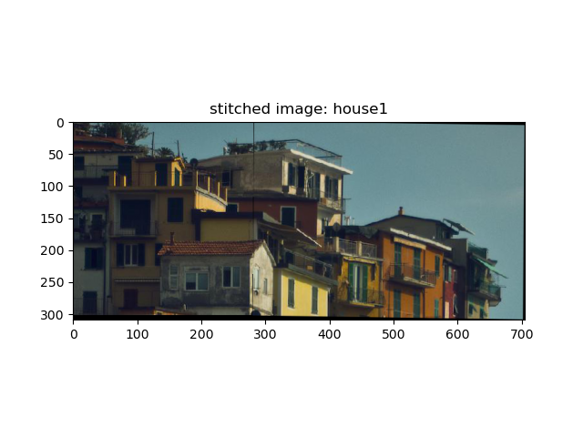

# Image-Stitching

## Task
Given two images which are related by an unknown transformation. Our goal is to detect features using the blob detector, extra SIFT features from them, match the features and then use the Random sample consensus (RANSAC) to estimates the best affine transformation. Once we have these affine transformations, we can use that to stitch the two images.

## Input

    
    

## Output

